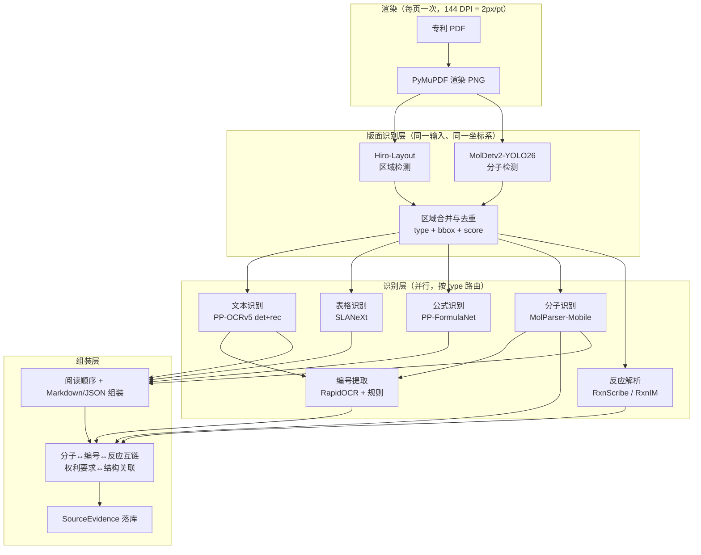

# ChemLayout 设计文档：开源版化学专利文档解析框架

> 版本：v0.2 · 适用范围：化学专利文献（权利要求、说明书、实施例、Markush 定义表）结构化提取
> 定位：只使用开源组件与自有代码，本地部署优先，产出可溯源（页码 + 框 + 编号）的分子清单与反应清单
> 与 MBForge 的关系：复用其渲染/证据/审核/关联设计，但按"统一解析图"从底层重构，分子检测提升为文档解析的一等区域检测模块

> **命名约定（v0.2 起）**：不再使用 `M0`/`M1`/`M2` 这类编号，**一律按职能/任务命名**。
> 每个阶段的目录名等于它的职能名（`layout/` = 版面识别，`ocr/` = 文本识别）。

---

## 0. 实施现状

| 阶段 | 目录 | 模型 / 实现 | 状态 |
| --- | --- | --- | --- |
| 渲染 | （内联在各脚本） | PyMuPDF | ⚠️ 部分 |
| **版面识别** | **`layout/`** | **Hiro-Layout + MolDetv2-YOLO26** | ✅ **已实现** |
| **文本识别** | **`ocr/`** | RapidOCR（评估用） | ⚠️ 已跑通，**引擎未定** |
| 表格识别 | — | SLANeXt | ❌ 未实施 |
| 公式识别 | — | PP-FormulaNet | ❌ 未实施 |
| 分子识别 | — | MolParser-Mobile | ❌ 未实施 |
| 编号关联 | — | RapidOCR + 规则 | ❌ 未实施 |
| 反应解析 | — | RxnScribe / RxnIM | ❌ 未实施 |
| 组装与关联 | — | 自有代码 | ❌ 未实施 |
| 服务编排 | — | FastAPI | ❌ 未实施 |

**当前只到「版面检测 + 合并 + 输出 bbox」+「文本区域 OCR」为止。**
`image` / `chart` 区域**只出 bbox 四元组，不做识别**（不主动识别图片内容）。

### 0.1 两条已定决策

**决策 1：版面识别 = Hiro 联合 MolDet，不再维护 V3 与 Hiro 双轨。**

`DESIGN.md` 早期版本把版面检测与分子检测拆成两个并列模块（V3 + MolDet），
实测后合并为一个阶段、一个目录 `layout/`，内部两个模型：

| 模型 | 职责 | 权重位置 | 运行时 |
| --- | --- | --- | --- |
| **Hiro-Layout**（PatSnap，RT-DETR-X） | 出 text / table / header / footer / image / chart / chem / rxn 等区域框 | `layout/weights/hiro/`（250.31 MiB） | **onnxruntime-gpu**（ONNX-only） |
| **MolDetv2-YOLO26**（UniParser） | 出 molecule 框 | `layout/weights/moldet/`（5.21 MB） | ultralytics / PyTorch |

选 Hiro 而非 V3 的依据（详见 `layout/README.md` §12.5/§12.8）：

- **正文召回更好**：可信子集（62 页真矢量 PDF）上 **94.6% vs V3 的 89.2%**（+5.4 点），长尾失败页更少。
- **速度更快**：GPU 上 **122 ms/页** vs V3 的 193.7 ms/页（1.6 倍）。
- **类别体系更贴合专利**：`chem` / `rxn` / `figcx` / `mnote` / `figno` / `head` / `foot` 都是 V3 没有的。
- ⚠️ **已知代价**：两个版面模型**都几乎抓不到化学结构式**（中位召回 0.000），
  结构式实际由 **MolDet 兜底**。实测 `CN114072393A_p0054` 有 3 个矢量结构式，
  Hiro 输出 0 个 image 区域，而 MolDet 精确抓到 3 个。
  → **`Hiro ∪ MolDet` 是本设计的承重组合，不是可选叠加**（§9 风险 1）。
- ⚠️ **阻塞项**：Hiro 权重授权**需 PatSnap 书面澄清**（AGPL 字符串 vs Apache-2.0 声明，§7）。

V3 的实现保留在 `layout/v3.py`，仅作对照基线，不在生产路径上。

**决策 2：全部页面按扫描件处理，不做数字版分流。**

一律走 **渲染 → 版面识别 → 文本识别** 的同一条路径，不再为数字版 PDF 另开
"直接读文本层"的分支。理由：

- 语料 550 份专利里 **扫描件占多数**（256 页样本中 177 页无文本层），
  为少数数字版维护第二条路径，收益与复杂度不成比例；
- **本批所谓"数字版"多数其实是扫描图 + 不可见 OCR 文本层**（可检索 PDF），
  实测 76 页有文本层的页面里，**14 页的真值是 OCR 输出而非作者排版**
  —— 这条分支的收益本身就比预期小得多；
- 单路径消除了"两套坐标系/两套降级语义"的分叉。

代价：数字版页也要付一次 OCR 成本。已接受（版面识别 + OCR 的预算见 §6.3）。

### 0.2 实测基线

版面识别（256 页真实化学专利，144 DPI，RTX 3070 Ti Laptop）：

- 检出量：Hiro 13.4 区域/页 + MolDet 2.7 分子/页 → 合并后 13.0 区域/页
- 耗时（稳态，GPU）：**Hiro 122 ms/页**（batch=8）+ MolDet ≈ 52 ms/页
- 质量：`layout/README.md` §12.5（双向真值评测）
- 详细数据、已知缺陷与调参记录：`layout/README.md`

---

## 1. 目标与约束

### 1.1 目标

- 输入：化学专利 PDF（本版设计**统一按扫描件处理**，见 §0.1 决策 2）。
- 输出（每条都可溯源到页码 + 页内 bbox + 化合物编号）：
  - 整篇 Markdown / JSON（含文本、表格、公式、分子占位）；
  - Molecule Summary List（分子 + 来源位置 + 标识符 + SMILES/E-SMILES + MolFile）；
  - Reaction Summary List（反应物 / 条件 / 产物 + 关联分子）；
  - SourceEvidence 结构化证据（SQL，供检索、验收与审核队列）。

### 1.2 约束

- 组件只选开源项目（见 §7 授权清单）；"开源 ≠ 可商用"，逐项核对 LICENSE。
- 全文 OCR 本地优先（保密）；云端仅作可选后备。
- 单页单次渲染、统一坐标系，避免"先解析再回找坐标"的二次映射。
- **GPU 优先**：所有可上 GPU 的推理一律走 GPU（CPU 配置不作为对照保留）。
- 环境用 `uv` 管理，项目级 `.venv`（`pyproject.toml` + `uv sync`）。

---

## 2. 总体架构：统一解析图

核心思想：解析 = 渲染 → 区域检测 → 类型化路由 → 并行识别 → 组装。
**版面区域检测（Hiro）与分子检测（MolDet）是同一层、同一契约的两个模型**，
结果合并为一份类型化区域集合，再按类型路由到并行识别模块，最终合并为一颗统一结果树。



设计原则：

1. **一次渲染多处复用**：版面识别、文本识别以及各识别模块的裁剪都基于同一张 144 DPI 页面图，根除坐标漂移。
2. **统一区域模型**：一切区域都是 `{type, bbox_pdf, bbox_px, score, content}`，分子/反应与文本/表格同构。
3. **模块可替换**：每个模块有独立 I/O 契约，换模型只改 `model_dir` 或实现，不改变图结构。
4. **跨模块共享文本**：文本识别的结果显式传递给编号关联与反应解析（这是编排层必须支持的依赖，见 §5.2）。
5. **失败隔离**：每个模块独立降级；化学相关模块失败静默返回空，文本与证据链不受影响。

---

## 3. 统一数据契约

### 3.1 坐标约定

| 项 | 约定 |
| --- | --- |
| 文档坐标 | PDF 点（pt），原点在页面**左下角**，y 轴向上（bottom-left origin） |
| 渲染坐标 | 144 DPI，2 px/pt（与 MBForge `_OCR_RENDER_PX_PER_PT = 2.0` 一致） |
| 转换 | `bbox_pdf = bbox_px / 2.0`（x 不变，y 翻转：`y_pdf = page_height_pt - y_px / 2.0`） |
| 分子检测 | 整页复用 144 DPI 图；如需更高分辨率，仅对裁剪区域二次采样（默认 200 DPI，对应 MBForge `detection_dpi`） |
| 上传服务 | 提交给 OCR 服务的图像**不做**方向分类/矫正/图表预处理（默认关闭），保持几何不变，保证坐标映射有效 |

### 3.2 统一区域模型

```python
class RegionType(str, Enum):
    TITLE = "title"; TEXT = "text"; TABLE = "table"; FORMULA = "formula"
    IMAGE = "image"; HEADER = "header"; FOOTER = "footer"; PAGE_NUMBER = "page_number"
    SEAL = "seal"; CHART = "chart"
    MOLECULE = "molecule"; REACTION = "reaction"   # 分子/反应为一等区域类型

@dataclass
class Region:
    region_id: str                      # f"{doc_id}-{page}-{type}-{seq}"
    type: RegionType
    bbox_pdf: tuple[float, float, float, float]   # x0,y0,x1,y1 @ pt, bottom-left
    bbox_px:  tuple[int, int, int, int]           # 渲染像素
    score: float
    source: str                         # "layout_hiro" | "layout_v3" | "molecule_det" | "merged"
    content: RegionContent | None
    children: list[Region]              # 表格单元格、多栏子区域、1:N 容器内的分子
    polygon_px:  list[tuple[float, float]] | None = None   # 检测器 mask 轮廓（已产出，暂无消费方）
    polygon_pdf: list[tuple[float, float]] | None = None
    reading_order: int | None = None                       # 若检测器自带逻辑阅读序
    meta: dict | None = None            # 合并元数据：container / molecule_count / spans / merged_from
```

### 3.3 类型化内容（RegionContent）

| type | content 字段 | 生产者 |
| --- | --- | --- |
| TEXT | `text`, `spans[]`（每行文本 + bbox + conf） | 文本识别 |
| TABLE | `html`, `cells[]`, `markdown` | 表格识别 |
| FORMULA | `latex` | 公式识别 |
| MOLECULE | `smiles`, `e_smiles`, `carbon`(可选), `molfile`(导出时), `identifier`(关联后回填) | 分子识别 / 编号关联 |
| REACTION | `reactants[]`, `products[]`, `conditions[]`, `linked_molecule_ids[]` | 反应解析 |
| CHART | `table`, `markdown`（Phase 2 可选） | 图表解析（可选） |

### 3.4 文档级输出

```python
@dataclass
class PageParseResult:
    page_num: int
    width_pt: float; height_pt: float
    dpi: int = 144
    regions: list[Region]
    raw_text: str
    markdown: str
    ocr_stats: dict

@dataclass
class DocumentParseResult:
    pages: list[PageParseResult]
    molecule_summary: list[MoleculeRecord]    # 分子 + 来源位置 + 标识符 + SMILES/E-SMILES
    reaction_summary: list[ReactionRecord]    # 反应物/条件/产物 + 关联分子
    associations: list[Association]           # 权利要求↔结构、编号↔分子、反应↔分子
```

### 3.5 错误与降级语义

- 任一页面文本为空：中止整篇（沿用 MBForge OCR-only 契约，绝不静默吞页）。
- 化学模块（分子识别/编号关联/反应解析）失败：该区域置 `content=None` + `error`，其余照常；整体结果标记 `degraded`。
- RapidOCR（编号关联用）不可用：静默返回空（富化语义，不阻断）。

---

## 4. 模块设计（模型 · 输入 · 输出 · 内部传递）

> 每个模块统一给出：角色、模型/实现、输入、输出、关键参数、依赖与数据传递。

### 4.1 渲染 render

| 项 | 内容 |
| --- | --- |
| 角色 | 全图唯一数据源：把 PDF 变成所有模块共享的页面图像 |
| 实现 | PyMuPDF（fitz），复用 MBForge `extract` 的渲染参数 |
| 输入 | PDF 路径 / 单页图像 |
| 输出 | `page_image`（144 DPI PNG）+ `PageMeta{page_num, width_pt, height_pt, dpi}` |
| 关键参数 | `zoom=2.0`（144 DPI）；分子区域可选 200 DPI 二次采样 |
| 依赖 | 无（最上游） |

**内部传递**：`page_image` 分发给版面识别与文本识别；各识别模块的输入裁剪由此处的 bbox 切出。

> ⚠️ 状态：目前渲染**内联在各脚本里**（如 `layout/detect_overlay.py`），尚未独立成模块。

### 4.2 版面识别 layout · **已实现**

| 项 | 内容 |
| --- | --- |
| 角色 | 检出文本/表格/公式/图像/分子等**全部区域**，输出统一类型的区域集合 |
| 目录 | `layout/` |
| 模型 | **Hiro-Layout**（PatSnap，RT-DETR-X，ONNX）+ **MolDetv2-YOLO26**（960_doc） |
| 输入 | `page_image`（144 DPI PNG） |
| 输出 | `regions[]`：含 `bbox_px`、`bbox_pdf`、`score`、`type`、`polygon_*`、分子挂载关系 |
| 关键参数 | Hiro：`imgsz=640`（**只有 640×640 letterbox 是有效工作点**）、conf 0.4、面积下限 0.1% 页面<br>MolDet：`imgsz=960`、conf 0.4 |
| 运行时 | Hiro 走 **onnxruntime-gpu**（CUDA EP，建 session 前必须 `preload_dlls()`）；MolDet 走 ultralytics/PyTorch |
| 依赖 | 渲染 |
| 授权 | Hiro **需 PatSnap 书面澄清**；MolDet 为 CC-BY-NC-SA-4.0（**非商用**） |

#### 合并去重规则（`layout/merge.py`，R1–R5）

| 规则 | 内容 | 阈值 |
| --- | --- | --- |
| R1 | 同类重复框去重，保留高分者 | IoU > 0.7 |
| R2 | 文本流内嵌抑制：行内子块降级为父块 span | 子块面积 < 父块 1% 且被父块包含 > 0.8 |
| R3 | 跨模型 1:1 让位：区域改为 `molecule` | 分子框与区域 IoU > 0.7 |
| R4 | 跨模型 1:N 容器：保留为容器，分子挂 `children` | 分子框被区域包含 > 0.8 |
| R5 | 文本框两两去重叠（有交集即并集合并） | 交集 > 0 |

> **R4 不能省**：实测一个 `image` 区域里装着 **16 个**分子，若按"包含即让位"整块改判，
> 会把"16 个分子的合成路线"误标成"1 个分子"。

> **R2/R5 的词表可覆盖**：R2/R5 默认集合是**某个检测器的 label 词表**。
> 实测这是本模块最早的隐式耦合——换检测器后 R3/R4 命中数归零、685 个分子全部沦为 standalone。
> 已改为 **R3/R4 按 `RegionType` 匹配**（非 label），R2/R5 的词表通过 `params` 覆盖
> （Hiro 的集合见 `layout/hiro.py::HIRO_MERGE_LABELS`）。

#### 已知缺陷（实测）

⚠️ **两个版面检测器都几乎抓不到化学结构式**（中位召回 0.000）。
结构式实际由 **MolDet 兜底**——实测 `CN114072393A_p0054` 有 3 个矢量绘制的结构式，
**Hiro 与 V3 都输出 0 个 image 区域**，MolDet 精确抓到 3 个。
→ **版面识别是"两个模型的并集"这件事是承重设计，不是可选优化**（§9 风险 1）。

⚠️ **Hiro 不输出阅读顺序**（V3 的输出顺序即逻辑阅读序，实测两栏页有 323 px y 回跳）。
Hiro 官方靠 `column_sort` 那套硬编码启发式。**阅读顺序的恢复责任在组装层**，见 §4.10。

#### 待吸收的外部设计（来自 `refs/Hiro-Smart-Doc/`）

源码级分析见 `docs/HIRO-SMART-DOC-ANALYSIS.md`。两条值得移植：

1. **两级类别体系（细类 → category → RegionType）**。当前 `RegionType` 是平铺一层，
   每换一个检测器就要重写一遍映射。加一层 `category` 可解耦
   模型词表 / 产品词表 / 路由词表，并把 category 暴露为编排器的过滤开关（分析文档 §4.1）。
2. **去重规则用"basic / complex 二分 + 包含比判据"**替代按 label 白名单手调的 R1/R2：
   basic 类做类别无关 NMS，判据为 `IoU > 0.5` **或** `交集/较小框面积 > 0.7`；
   complex 类只做类别内 NMS。⚠️ 必须按**名字**派生 complex 集合，不能照抄其裸下标数组（分析文档 §4.2）。

### 4.3 文本识别 ocr · 已跑通，**引擎未定**

| 项 | 内容 |
| --- | --- |
| 角色 | 页面全部文本 + 每行 bbox；文本结果供编号关联/反应解析/组装复用（全框架唯一文本源） |
| 目录 | `ocr/` |
| 当前实现 | RapidOCR（PP-OCRv6），只对**版面识别给出的 text 框内**做行级识别 |
| 目标模型 | PP-OCRv5_server_det + PP-OCRv5_server_rec（中英多语言） |
| 输入 | `page_image`（与版面识别同一张图）+ 版面识别的 `text` 框 |
| 输出 | `text_spans[]`（text + bbox + conf）、`raw_text`（按阅读顺序拼接）、OCR 统计 |
| 关键参数 | 文本行方向分类默认关闭（保持坐标系）；并发默认 1；上传时关闭方向矫正/图表识别 |
| 依赖 | 渲染、版面识别 |
| 授权 | RapidOCR 开源；PP-OCRv5 Apache-2.0 |

**为什么必须"先区域检测、再路由"**：对同一批 32 页裸跑全页 OCR，共 2052 个文本行，
**38.2% 落在结构式/图区域内**（结构式里的取代基符号、试剂名、键标注），图重页高达 49.1%。
→ 不能对整页裸跑 OCR，必须先用版面区域把 `image`/`molecule` 遮掉。

**实测**：RapidOCR 的 torch 引擎确实不依赖 PaddlePaddle（本机 `import paddle` 失败仍完整跑通）；
`use_cuda` **默认 False**，不显式打开就在 CPU 上跑、差 4.7 倍；
PP-OCRv6 **没有 server 档**；`medium` 首次加载 **169.81 s**，生产必须预热缓存。
详见 `RUNTIME-PYTORCH.md` §5。

**未定的是引擎**：RapidOCR（PP-OCRv6）与 `paddleocr + engine="transformers"`（保 PP-OCRv5 精度）
二选一，须在 94k 页规模下按"精度 × 吞吐 × 加载时间"定夺。

### 4.4 表格识别 table

| 项 | 内容 |
| --- | --- |
| 角色 | 表格结构还原；对化学专利重点是 **Markush 定义表（R1–Rn）与条件筛选表** 的版式 |
| 模型 | SLANeXt_wired / SLANeXt_wireless + 单元格检测（RT-DETR-L）+ 表格方向分类 |
| 输入 | 表格区域裁剪块（来自版面识别的 `table` 区域） |
| 输出 | `table_html`、`cells[]`、`markdown`；可选 XLSX |
| 语义边界 | 本模块只还原结构；R 基语义展开（Markush 实例化）留待 Phase 3（规则 + 人工审核） |
| 依赖 | 渲染、版面识别 |
| 授权 | Apache-2.0 |

### 4.5 公式识别 formula

| 项 | 内容 |
| --- | --- |
| 角色 | 文档中化学/数学公式转 LaTeX |
| 模型 | PP-FormulaNet_plus-S（速度档；官方 En-BLEU 约 87–92 档位）；可换 UniMERNet |
| 输入 | 公式区域裁剪块（版面识别的 `formula` 区域） |
| 输出 | `latex` |
| 依赖 | 渲染、版面识别 |
| 授权 | Apache-2.0 |

### 4.6 分子识别 molecule-recognition

| 项 | 内容 |
| --- | --- |
| 角色 | 分子区域图像 → 机器可读结构；输出 SMILES + E-SMILES（超原子/重复单元/Markush 片段保留） |
| 模型 | MolParser-Mobile（9.98M 参数，RTX 4090 约 1520 img/s；UniParserBench 0.823 / BioVista 0.801；E-SMILES 输出） |
| 备选 | MolScribe（MIT，商用安全）；若 GTR-CoT 发布，与 MolRecBench-Wild/CARBON 同源，优先评估 |
| 输入 | 分子区域裁剪块（版面识别的 `molecule` 框） |
| 输出 | `smiles`、`e_smiles`（`SMILES<sep>EXTENSION`，尾部裸 `<sep>` 必须剥离）、可选 `carbon`、`molfile`（RDKit 导出） |
| 关键参数 | batch 上限 64；GPU 门控 |
| 依赖 | 渲染、版面识别 |
| 授权注意 | MolParser-7M 数据集与 MolDet 为 CC-BY-NC-SA-4.0（**非商用**）；MolParser-Mobile 权重授权以 ModelScope 模型卡为准，商用前必须确认；商用场景直接切 MolScribe（MIT） |

### 4.7 编号关联 identifier

| 项 | 内容 |
| --- | --- |
| 角色 | 分子 ↔ 化合物编号（如 1a、2b、II）配对，让分子在全文可引用、可溯源 |
| 实现 | RapidOCR（本地，torch/onnx）+ 白名单规则 + 复用文本识别的全文文本 |
| 输入 | ① 分子裁剪块旁的 "others" 碎片图像（来自版面识别裁剪切分）；② 文本识别的页面 `raw_text`/`text_spans`；③ 分子框 |
| 输出 | `identifier ↔ molecule_id` 配对；`coref_primary`（右下优先、裸数字优先）；回填分子识别的 `identifier` 字段 |
| 过滤规则 | 只保留数字开头（4A、8b、11-a）或罗马数字（II、I-1）形态、conf≥0.9、独立成行的文本；丢弃 CF3、NH、(R) 等结构内容与试剂名 |
| 部署 | inprocess（进程内）或 daemon（常驻 127.0.0.1:18799） |
| 依赖 | 版面识别、文本识别、RapidOCR（**跨模块文本复用：文本识别输出直接喂给本模块**） |
| 降级 | 失败静默返回空（富化语义，绝不阻断提取） |

### 4.8 反应解析 reaction

| 项 | 内容 |
| --- | --- |
| 角色 | 反应式区域 → 反应物 / 条件 / 产物（专利实施例的核心抽取目标） |
| 模型 | RxnScribe（thomas0809/RxnScribe，开源，soft-match F1 80.0）或 RxnIM（MLLM，开源） |
| 说明 | RxnCaption / RxnID（MinerU.Chem 系）未发布，**不依赖**；发布后再评估替换 |
| 输入 | 反应区域裁剪块（版面识别的 `reaction` 框）+ 可选文本识别结果（条件文字、溶剂/温度） |
| 输出 | `reaction{reactants[], products[], conditions[]}` + `linked_molecule_ids[]` |
| 依赖 | 渲染、版面识别、文本识别、分子识别/编号关联（分子引用回填） |
| 授权 | RxnScribe 为 MIT |

### 4.9 组装与关联 assemble

| 项 | 内容 |
| --- | --- |
| 角色 | 把各模块结果合并为文档级产物，并做专利特有的确定性关联 |
| 功能 | ① **阅读顺序恢复**；② Markdown 组装（文本/表格 HTML/LaTeX/分子占位符）；③ 互链：molecule↔identifier↔reaction；④ 权利要求↔结构关联（在 TEXT 区域匹配 "compound of formula I / 式I" 等模式并链接到分子）；⑤ SourceEvidence 写入（block_type 扩展 `text/table/formula/molecule/reaction`） |
| 输出 | `DocumentParseResult`；Markdown/JSON；SDF/XLSX 导出；审核队列数据 |
| 证据模型 | 沿用 MBForge：`{library_root}/.mbforge/library.db` 的 SourceEvidence，坐标统一可回溯 |

> ⚠️ **阅读顺序是本层的新增责任**。V3 的输出顺序自带逻辑阅读序（实测两栏页 323 px y 回跳），
> **Hiro 不输出顺序**——官方靠 `column_sort` 启发式。
> 因此不能直接消费检测输出下标，必须在本层显式恢复并校验。

### 4.10 服务编排 orchestrator

| 形态 | 说明 | 状态 |
| --- | --- | --- |
| B：自有编排器 | FastAPI 编排器，按图调度各模块服务，负责跨模块文本传递与缓存 | **唯一形态** |
| ~~A：PaddleX 自定义产线~~ | ~~把各模块注册进一条产线 YAML~~ | **已删除**（属 PaddlePaddle 侧，与 PyTorch 单栈约束冲突） |

---

## 5. 内部数据流

### 5.1 端到端时序

```
1. ingest(专利PDF)
2. 逐页：渲染 → page_image（144 DPI）
3. 每页内：版面识别（Hiro ‖ MolDet 同一张图）→ 区域合并去重 → 类型化区域集合
4. 按 type 并行路由：
   - text 区域   → 文本识别（整页文本，供编号关联/反应解析/组装复用）
   - table 区域  → 表格识别
   - formula 区域→ 公式识别
   - molecule 框 → 分子识别（main 裁剪）+ 编号关联（others 碎片 + 文本）
   - reaction 框 → 反应解析（+ 文本识别结果）
5. 编号关联产出 identifier ↔ molecule 配对，回填分子识别
6. 组装：阅读顺序恢复 → Markdown/JSON → 互链 → SourceEvidence → 摘要清单
7. 服务返回 / 落库 / 审核队列 / 导出
```

### 5.2 跨模块传递清单（谁生产、谁消费）

| 数据 | 生产者 | 消费者 |
| --- | --- | --- |
| `page_image`（144 DPI） | 渲染 | 版面识别、文本识别、各识别模块（裁剪源） |
| `regions[]`（版面区域） | 版面识别 | 表格识别、公式识别、组装 |
| `molecule_boxes[]` | 版面识别（MolDet） | 分子识别、编号关联、组装 |
| `text_spans` / `raw_text` | 文本识别 | 编号关联、反应解析、组装（**关键跨模块依赖**） |
| `table_html` / `cells` | 表格识别 | 组装 |
| `latex` | 公式识别 | 组装 |
| `smiles` / `e_smiles` | 分子识别 | 编号关联（编号回填）、组装 |
| `identifier ↔ molecule` | 编号关联 | 组装 |
| `reaction{reactants/products/conditions}` | 反应解析 | 组装 |
| 裁剪块 PNG（`{doc_id}/{page}/{region_id}.png`） | 渲染 + 版面识别 | 审核、调试、重试 |

### 5.3 中间缓存与失败隔离

- 所有裁剪块与 OCR 原始响应落盘（`{library_root}/storage/{doc_id}/`），供审核队列展示与问题复现。
- 每模块独立 try/catch：化学模块失败 → 该区域 `error` 标记 + 整体 `degraded`；文本空页 → 中止整篇。
- GPU 资源：MolDet / 分子识别走 `gpu_gate()`；RapidOCR 默认 torch(CUDA) 经门控，无 CUDA 回落 onnx(CPU)。

---

## 6. 服务拓扑

> §6.1 原 PaddleX 自定义产线 YAML **已删除**——运行时限定 PyTorch 单栈，产线属 PaddlePaddle 侧。
> 原 A+B 混合方案简化为**纯自有编排器**。详见 `RUNTIME-PYTORCH.md` §6.1。

### 6.1 端点

- `POST /parse`：整篇解析（多页），返回 `DocumentParseResult`（JSON）+ Markdown 附件。
- `POST /page`：单页解析（调试/增量）。
- `GET /health`：各模块就绪状态（模型加载、CUDA、版本）。

### 6.2 编排

自有编排器（FastAPI）按 §5.1 的图调度各模块。删除产线后的直接收益：

- **自定义模块不再需要按任何既有接口封装**，`layout/merge.py` 这类自有逻辑就是普通 Python 调用。
- **跨模块传递不再是"标准产线不支持的例外"**，文本识别→编号关联/反应解析的文本传递是普通参数。
- §9 风险（PaddleX 扩展成本）随之消失。

**进程隔离仍建议保留**：单栈消除了框架冲突，但**未消除显存与线程争抢**——
实测 MolDet 与版面检测串行跑在同卡上会互相拖慢。

### 6.3 模型加载与预热

- **必须启动预热**：冷启动首次调用约 750 ms（CUDA kernel 编译 / cuDNN autotune），
  预热后稳定在 ~110 ms，差 6 倍。否则第一个请求会显著慢于稳态。
- **Hiro 同样适用**：单页 CLI 会显示 ~740 ms，那是进程内第一次推理；稳态是 122 ms/页。
- 若后续引入 RapidOCR 的 `medium` 档，其首次加载实测达 **169.81 s**，必须做权重预热缓存。

**预算**（94,759 页，GPU）：版面识别约 **3.2 h**（Hiro batch=8）+ MolDet 约 **1.0 h**；
OCR 按 0.4–0.75 s/页估 **10–20 h**。整条管线在"过夜跑完"区间内。

---

## 7. 授权清单（开源 ≠ 可商用，逐项核对）

| 组件 | 用途 | 授权 | 商用 |
| --- | --- | --- | --- |
| **Hiro-Layout**（PatSnap） | **版面识别（已实施）** | 模型卡/`LICENSE` 写 **Apache-2.0**，但 ONNX 内嵌元数据写 **AGPL-3.0**（ultralytics 导出器样板字段）→ **需书面澄清** | ⚠️ 澄清前按 AGPL 处理 |
| PP-DocLayoutV3 | 版面识别对照基线（`layout/v3.py`，非生产路径） | Apache-2.0 | ✅ |
| **MolDetv2-YOLO26** | **分子检测（已实施）** | **CC-BY-NC-SA-4.0**（非商用） | ⚠️ 确认 |
| MolParser-Mobile / MolParser-7M | 结构识别 / 训练数据 | 数据集与 MolDet 为 CC-BY-NC-SA-4.0；Mobile 权重以 ModelScope 模型卡为准 | ⚠️ 确认 |
| PaddleOCR / PP-OCRv5 / SLANeXt / PP-FormulaNet | OCR/表格/公式（**权重来源**，运行时为 transformers；表格/公式未实施） | Apache-2.0 | ✅ |
| PaddleOCR-VL（可选） | VLM 版 layout parsing | 项目 Apache-2.0，模型授权以模型卡为准 | ⚠️ 核对 |
| MolScribe / RxnScribe | 结构识别 / 反应解析 | MIT | ✅ |
| RxnIM | 反应解析（MLLM） | 开源，仓库授权以 LICENSE 为准 | ⚠️ 核对 |
| MolRecBench-Wild / CARBON | 评测集 / 图表示规范 | 开源 | ✅（评测用途） |
| RapidOCR | 文本识别 / 编号标签 OCR | 开源 | ✅ |
| ChemScraper | 数字版专利矢量解析 | 开源 | ❌ **本版不使用**（§0.1 决策 2：统一按扫描件处理） |
| PatentFinder / MolPatent-240 | 专利侵权/关联参考 | 开源 | ⚠️ 核对 |
| BioChemInsight | 结构抽取参考 | 开源 | ⚠️ 核对 |
| MinerU（本体） | 不使用 | AGPL-3.0 | ⚠️ 避免引入 |
| GTR-CoT / RxnCaption / RxnID | 结构识别/反应（候选） | 论文承诺发布，**当前未落地** | — 待发布 |

> ⚠️ 另有一条更硬的约束：**MBForge 本体是 CC BY-NC-SA 4.0（非商用）**。
> 授权是本项目**唯一会强制返工**的风险类别，见 §9 风险 2。

---

## 8. 分阶段实施

| 阶段 | 范围 | 验收标准 |
| --- | --- | --- |
| Phase 1 基线 | 统一渲染 + 区域模型 + SourceEvidence 扩展 block_type + 版面识别（Hiro ∪ MolDet）接入同一坐标系 | 专利 PDF → 分子框全部可溯源；单页单次渲染 |
| Phase 2 化学层 | 分子识别/编号关联/反应解析模块化接入；CARBON/MolRecBench-Wild 建立识别评测基线；E-SMILES 保留超原子语义 | Molecule/Reaction Summary List 自动产出；评测指标基线固定 |
| Phase 3 闭环 | 权利要求↔结构关联；Markush 定义表结构还原 + R 基展开试点（规则+人工）；审核队列；SDF/XLSX 导出 | 端到端可验收：导出产物与人工抽检一致率达标，全部条目可溯源 |

---

## 9. 风险与待确认

1. **【实测】版面检测器抓不到化学结构式，承重的是分子检测**：Hiro 与 V3 **都**几乎抓不到
   化学结构式（中位召回 **0.000**）。实测 `CN114072393A_p0054` 上两者都输出 0 个 image 区域，
   而 MolDet 精确抓到 3 个。
   → **`Hiro ∪ MolDet` 的并集是承重设计，不是可选优化**；任何"只跑版面模型"的简化方案都不成立。
   数据：`layout/README.md` §12.5。

2. **授权**：Hiro 权重需 PatSnap 书面澄清（AGPL 字符串 vs Apache-2.0 声明）；
   MolParser 系与 MolDet 为非商用条款。这是**唯一会强制返工**的风险类别，商用前必须闭环。
   GTR-CoT/RxnID 若发布，需重新评估。

3. **Hiro 不输出阅读顺序**：V3 的输出顺序自带逻辑阅读序（实测两栏页 323 px y 回跳），
   Hiro 没有。→ 阅读顺序恢复责任落在组装层，**必须显式实现并校验**，否则两栏页会串行。

4. ~~**PaddleX 扩展成本**~~ → **已消除**：运行时改为 PyTorch 单栈、删除产线后，自定义模块无需按任何接口封装。

5. **Markush 全自动展开**：三家（PaddleOCR/MinerU.Chem/MBForge）均未解决；
   本设计以"表格结构还原 + E-SMILES 超原子 + 人工审核"过渡。

6. **扫描件质量**：当前以**方正页面**为前提。检测器的多边形能力保留（`polygon_*` 已产出），
   但**暂无消费方**——测试覆盖范围内的页面均无畸变，因此"需方向矫正"的诉求**未经实测验证**。

7. **坐标一致性**：任何模块开启"方向分类/矫正"都会破坏 2px/pt 映射，必须统一在渲染原语层处理。
   当前实现严格不启用任何矫正。

8. **版本兼容**：产线已删除，暴露面缩小到各模块的 `predict()` 接口与 transformers 版本。

9. **【实测】检测器标签在化学专利上语义漂移**：V3 的 `formula` 严重过触发（CN 页 8 个全为 MS 上下标碎块）；
   `figure_title` 命中的是化合物系统命名；`formula_number` 命中的是正文片段。
   → 已实施 **conf 0.4 + 面积下限 0.1% 页面**；但领域规则（按内容改判）**尚未实现**。

10. **【实测】裸跑全页 OCR 会引入大量污染**：实测 38.2% 的识别文本行落在结构式/图区域内。
    → 必须先按区域类型遮罩再 OCR，见 §4.3 / §5.1。

11. **【源码分析】版面识别导出的 evidence 不是合法的 MBForge `SourceEvidence`**：
    `layout/v3.py::to_evidence` 把 `raw_text` 与 `coref` 都留空，而
    `mbforge/core/evidence.py::SourceEvidence.__post_init__` **要求二者至少一个非空**（否则 `ValueError`）。
    这是接入 MBForge 的**实际阻塞项**，且**版面模块单独永远满足不了**——只能靠文本识别（出 `raw_text`）
    或裁剪图落盘（出 `coref`，且必须是库内相对路径）。
    → 可行的免 OCR 路子：`image`/`molecule` 区域裁图落盘、`coref` 指向它。
    详见 `docs/HIRO-SMART-DOC-ANALYSIS.md` §4.4-D。

12. **环境未自洽**：项目 `.venv` 目前**只有 Hiro 需要的一半**（`onnxruntime-gpu` 有，**torch/ultralytics 没有**）。
    因此 `layout/detect_overlay.py --layout hiro` 在自有 venv 里跑不了（它会连带导入 `v3.py` → torch）。
    补齐方式：把 `torch` + `ultralytics` 装进自有 venv；或让版面识别的"纯 Hiro"路径不依赖 `v3.py`。

---

## 10. 参考

- 版面识别实测与调参：`layout/README.md`（§12 为 Hiro 专章）
- 运行时与环境决策：`RUNTIME-PYTORCH.md`
- Hiro-Smart-Doc 源码级分析：`docs/HIRO-SMART-DOC-ANALYSIS.md`
- PP-StructureV3 官方文档：https://www.paddleocr.ai/latest/version3.x/pipeline_usage/PP-StructureV3
- MoleculeSumBench / MinerU.Chem（arXiv 2608.03525）：https://arxiv.org/abs/2608.03525
- MolRecBench-Wild / CARBON（arXiv 2605.05832）：https://arxiv.org/html/2605.05832v1
- GTR-CoT / GTR-VL（arXiv 2506.07553，承诺开源）：https://arxiv.org/html/2506.07553v3
- MolParser（arXiv 2411.11098，E-SMILES）：https://arxiv.org/html/2411.11098v3
- MolParser-Mobile（arXiv 2609.05807）：https://arxiv.org/pdf/2609.05807
- RxnScribe（arXiv 2305.11845）：https://ar5iv.labs.arxiv.org/html/2305.11845
- RxnIM（arXiv 2503.08156）：https://arxiv.org/html/2503.08156
- RxnCaption（arXiv 2511.02384，未发布）：https://arxiv.org/html/2511.02384v1
- ChemScraper（arXiv 2311.12161）：https://arxiv.org/html/2311.12161v5
- PaddleOCR 官网（Apache-2.0）：https://www.paddleocr.ai/main/en/index/index.html
- Hiro-Smart-Doc（PatSnap 开源服务，Apache-2.0）：https://github.com/patsnap/Hiro-Smart-Doc
- Hiro-Layout（版面权重）：https://huggingface.co/PatSnap/Hiro-Layout
